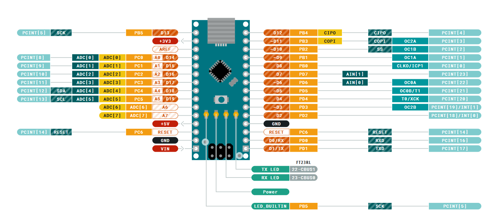

# Macetron 🪴

Sensors the humidity of the substrate, the temperature and the ambient humidity of a pot and displays the information obtained through an OLED screen.

## Pinout

| **Pin** | **Conected to** |
|:--------:|:---------------:|
| A4 | SDA OLED |
| A5 | SCL OLED |
| D4 | GND DHT22 |
| D5 | DATA DHT22 |